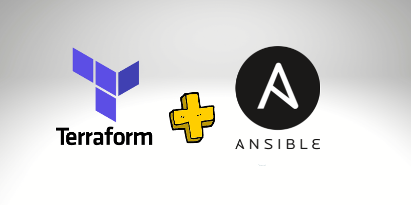

<p>
  
  
</p>

<h1 align="center">Terraform Module + Ansible </h1>

### Projeto terraform com modulo para provisionar infraestrutura na AWS e Ansible configurando API Django Rest Framework

## 1 - Modulo Infra.

### Input

- `instance` - "t2-micro"
- `aws_region` - "us-east-2"
- `ssh-key` - "ssh_key_name"
- `instance_name` - "dev"

### Output

- `IP` - IP publico
- `DNS` - DNS publico

### Usage

```hcl
module "aws_dev" {
  source        = "../../infra"
  instance      = "t2.micro"
  aws_region    = "us-east-2"
  ssh-key       = "iac_alura_dev"
  instance_name = "dev"
}

module "aws_prod" {
  source        = "../../infra"
  instance      = "t2.medium"
  aws_region    = "us-east-2"
  ssh-key       = "ssh_key_name"
  instance_name = "prod"
}
```

## 2 - Criando maquina de desenvolvimento.

```sh
cd env/dev
terraform init
terraform plan
terraform apply
```

## 3 - Executar projeto

```sh
terraform plan
terraform apply
```

## Autor

👤 **Marcus Vinicius**

- Github: [marcusjava](https://github.com/marcusjava)
